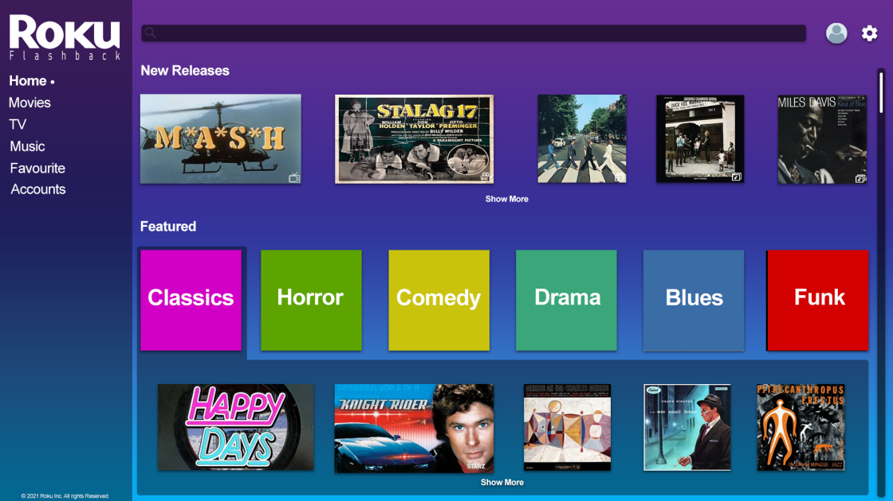

# Accessibility Research Project

### Overview
This is the Accessibility Research Project.

### Getting Started
This is an HTML / SASS  build.

To view the page clone this to the location of your choice, and open the "index.html" file to start at the home page. You can also view the source code by opening it in any code editing program of your choice, or clicking inspect in a chrome tab. The des and dev docs can both be found within the "assets" folder. 

### Prerequisites
All you need to run this page is an up to date browser.

## Authors
1. Greg Avery - developer / designer
